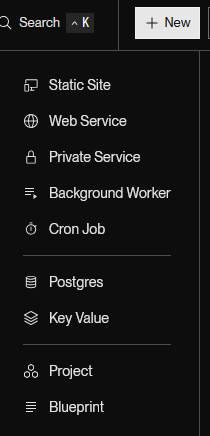
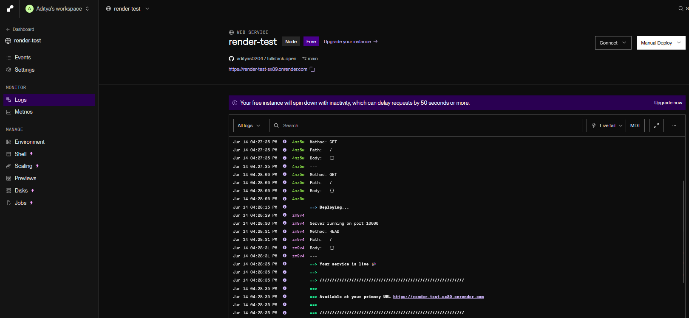
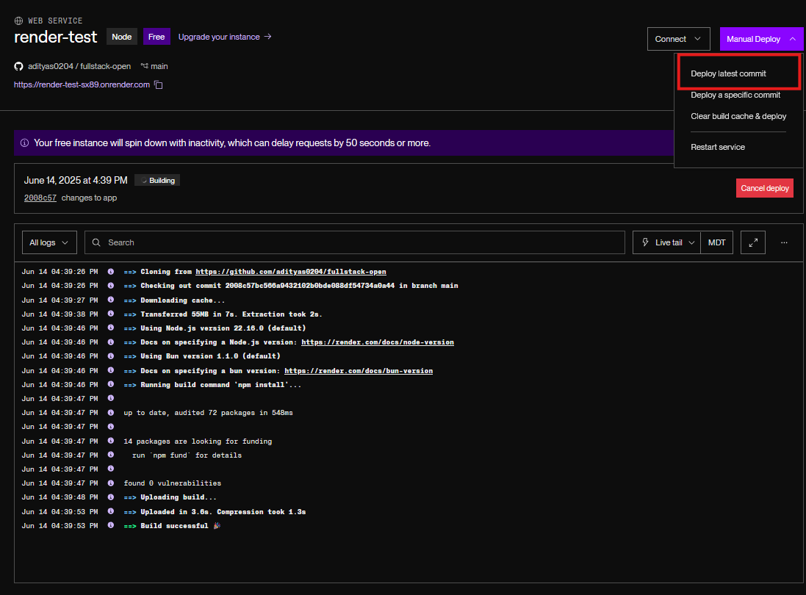
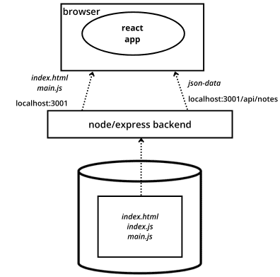

# [Deploying app to internet](https://fullstackopen.com/en/part3/deploying_app_to_internet)

- We will connect the _notes_ app frontend to the backend 
- Frontend could aks for notes from json-server backend on address http://localhost:3001/notes
  - New backend has diff structure, and notes at http://localhost:3001/api/notes
- Change `baseUrl` var to reflect this:

```js
const baseUrl = 'http://localhost:3001/api/notes'
```

- The frontend's GET request does not work
  - Why error?

### Same origin policy and CORS

- Problem with `same origin policy`
- URL's origin defined by combo of protocal (scheme), hostname, and port

```
http://example.com:80/index.html
  
protocol: http
host: example.com
port: 80
```
- CORS and Same-Origin Policy
  - When visiting a website (e.g. http://example.com), the browser makes a request to the server that hosts the domain.
    - The server responds with an HTML file, which may contain references to external assets (images, CSS, JS).
    - These assets may be on:
      - the same server
      - or a different server/domain (cross-origin)
- Same-Origin Policy
  - Browsers implement a same-origin policy to protect users from security threats (e.g. session hijacking).
  - Two URLs are considered the same origin if they share:
    1. Scheme (http vs https)
    2. Host (e.g. example.com)
    3. Port (e.g. :3001)
  - If a resource (script, data, etc.) is not from the same origin, the browser will:
    - Check if the server allows it using the Access-Control-Allow-Origin response header.
    - If the header contains * or the correct origin → allow the request
    - If the header is missing or incorrect → block the request and show a CORS error
- CORS (Cross-Origin Resource Sharing)
  - CORS is a mechanism defined by W3C that allows a server to permit cross-origin requests.
  - CORS enables:
    - Embedding images, stylesheets, scripts, iframes, videos from other origins
  - CORS restricts by default:
    - JavaScript (e.g. fetch, XMLHttpRequest) from making cross-origin requests unless explicitly allowed by the server
- Problem arises due to our server being on localhost port 5173, but our frontend being on port 3001
  - The origin is different
- Can allow requests from other _origins_ through Node's cors middleware
  - Install cors in backend: `npm install cors`
  - Use the middleware and allow requests from all origins:

```js
const cors = require('cors')

app.use(cors())
```

- Be intentional when enabling cors
  - In production, backend shouldn't be visible to public,. so only enable cors from specific origin
    - Such as frontend
- Almost all functionality works, except for changing importance due to not being implemented in the backend yet
- App setup:


- React app fetches data from node/express-server running on localhost:3001

### Application to the Internet

- Move app to internet since stack is ready
- Will use PaaS (Platform as a Service)
  - Allows user to not worry about underlying infrastructure
  - Can use [Heroku](http://heroku.com/) (student plan is alright), [Fly.io](https://fly.io/), [Render](https://render.com/), [Replit](https://replit.com/), or [CodeSandBox](https://codesandbox.io/)
  - Will stick to Render in this course
- For Render, we need to change definition of the port our app uses in `index.js`:

```js
const PORT = process.env.PORT || 3001
app.listen(PORT, () => {
  console.log(`Server running on port ${PORT}`)
})
```

#### Render

- Create a new _Web Service_



- Connect a public repo
- Define basic configs
  - If app is not at root of repo, then _Root directory_ needs to be given proper value:
    - The app in question is the server that we had created:


- Go to the bottom and click _Deploy_ 
- App will get deployed and it will inform you what the link is and the port:



- After pushing to your repo, you can redeploy the app:



### Frontend production build

-  We have been runinng React in _development mode_
   -  App gives clear error logs, renders code immediately to browser, and so on
-  When app is deployed, need to create a production build
   -  Version of app is optomized for production
-  Production build for Vite apps done with `npm run build`
   -  Run in frontend of notes app from part 2
-  A _dist_ directory is created
   -  Contains _index.html_ file of our app and _assests_ directory
   -  Minified versions of our app's JS code will be in _dist_ directory
   -  Minified code is not readable
-  

### Serving static files from the backend

- An option to deploy frontend is to copy the production build (_dist_ directory) to root of backend directory
  - Then configure backend to show frontend's _main page_ (_dist/index.html_ file) as its main page
- Start by copying production build (_dist_ directory) of frontend to root of backend:


- To make Express show _static content_ (page _index.html_ and JS), need to use built in middleware from Express called static:

```js
app.use(express.static('dist'))
```

 - When Express gets HTTP GET request, it will first check if _dist_ directory contains file corresponding to request's address 
   - File returned if found
 - "Now HTTP GET requests to the address www.serversaddress.com/index.html or www.serversaddress.com will show the React frontend. GET requests to the address www.serversaddress.com/api/notes will be handled by the backend code."
 - Now, frontend and backend are at same address, so declare `baseUrl` as relative URL
   - Leave out part declaring server:

```js
import axios from 'axios'

const baseUrl = '/api/notes'

const getAll = () => {
  const request = axios.get(baseUrl)
  return request.then(response => response.data)
}

// ...
```

- After change, create new production build of frontend, copy it to root of backend
- App can now be used from the _backend_ address http://localhost:3001/
- When browser goes to address http://localhost:3001/, server returns _index.html_ file from _dist_ directory
  - Contents of file:

```html
<!doctype html>
<html lang="en">
  <head>
    <meta charset="UTF-8" />
    <link rel="icon" type="image/svg+xml" href="/vite.svg" />
    <meta name="viewport" content="width=device-width, initial-scale=1.0" />
    <title>Vite + React</title>
    <script type="module" crossorigin src="/assets/index-DvWJzEIY.js"></script>
    <link rel="stylesheet" crossorigin href="/assets/index-DdXI-Iuh.css">
  </head>
  <body>
    <div id="root"></div>
  </body>
</html>
```

- File has instructions to fetch CSS stylesheet, and one _script_ tag that instructs the browser to fetch the JS code of the app - the actual React app
- React code fetches notes from the server address http://localhost:3001/api/notes and renders them to screen
  - Browser-server communication can be seen in _Network tab_ of developer console
- Setup for product deployment:



- Everything in same node/express-backend that runs in localhost:3001
  - This is unlike our developemt environment
- When browser goes to page, _index.html_ is rendered
- Which causes browser to fetch production version of React app
- Once starting, it fetches the json-data from address localhost:3001/api/notes

### The whole app to the internet

- Push the app to git and manual deploy on Render again
  - The app now works
- Everything is saved to a variable, if app restarts, then the data disappears
  - We need a database
- The setup of the app looks like the following:


- The backend resides in the Render server
  - The browser executes the React app and fetches the json-data from the Render server

### Streamlining deploying of the frontend

- To reduce manual work when creating production build, reate npm-scripts in _package.json_ of backend repo
- The script for Render is:

```json
{
  "scripts": {
    //...
    "build:ui": "rm -rf dist && cd ../frontend && npm run build && cp -r dist ../backend",
    "deploy:full": "npm run build:ui && git add . && git commit -m uibuild && git push"
  }
}
```

- "The script npm run build:ui builds the frontend and copies the production version under the backend repository. npm run deploy:full contains also the necessary git commands to update the backend repository"
- "Note that the directory paths in the script build:ui depend on the location of the frontend and backend directories in the file system."

### Proxy

- Changes to the frontend cause it to not work in dev mode when using `npm run dev`
  - Connection to backend is frayed since we use a relative URL:

```js
const baseUrl = '/api/notes'
```

- Frontend is at http://localhost:5173/
  - So requests go to http://localhost:5173/api/notes
  - But backend is at http://localhost:3001/
- If project created using Vite, then add following to _vite.config.js_ file in frontend directory:

```js
import { defineConfig } from 'vite'
import react from '@vitejs/plugin-react'

// https://vitejs.dev/config/
export default defineConfig({
  plugins: [react()],

  server: {
    proxy: {
      '/api': {
        target: 'http://localhost:3001',
        changeOrigin: true,
      },
    }
  },
})
```

- React dev env acts as proxy
  - If React code makes HTTP request to path starting with http://localhost:5173/api, then request forwarded to server at http://localhost:3001/
- Frontend works in development mode and production build
  - From frontend's perspective, all requests made to http://localhost:5173/, which is single origin, so no need for backend's cors middleware
- Remove cors library and dependency:

```bash 
npm remove cors
```

- The app has been successfully deployed to the internet

